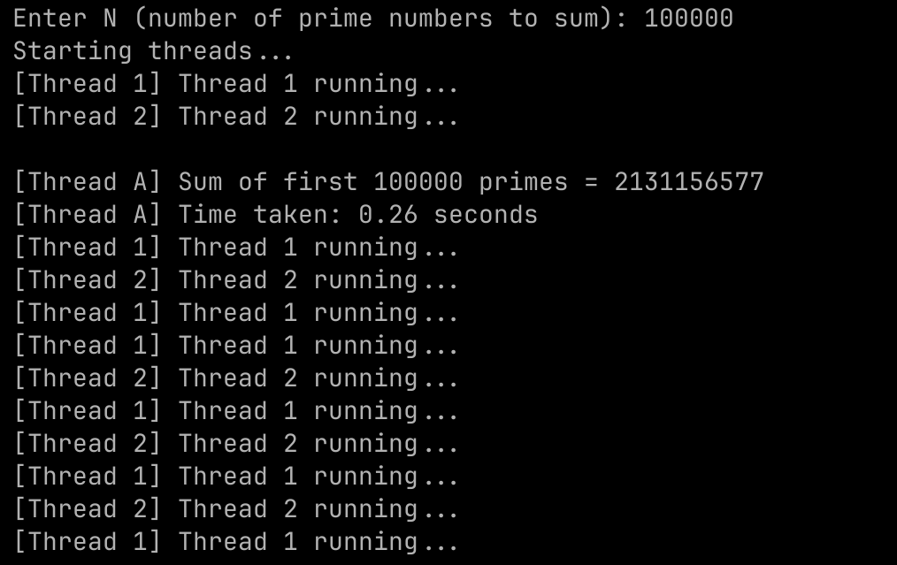

# 1. Program Output



## 2. Program Flow Summary

1. **Start timer**
2. **Register signal handler** to prevent Ctrl+C exit
3. **Take input `N`**
4. **Start threads:**
   -  Thread A: Calculates the sum of first `N` prime numbers
   - Thread B: Prints `"Thread 1 running"` every 2 seconds
   - Thread C: Prints `"Thread 2 running"` every 3 seconds
5. **Wait** for all threads to finish execution
6. **Print total execution time**

---

## Signal Handling

Handled `SIGINT` (Ctrl+C) to prevent termination using `SetConsoleCtrlHandler` on Windows:

```c
void sigint_handler(int sig) {
    printf("\nSIGINT received. Termination prevented. Use kill -9 to force quit.\n");
}
```
- This function catches the interrupt signal and prevents program termination when Ctrl+C is pressed.
Register it in your main() using:

```c
SetConsoleCtrlHandler(consoleHandler, TRUE);
```
# 3. 
## Child Process – `fork()`

- Used in Unix/Linux to create a new process.
- Duplicates the current process (parent), creating a new one (child).

### Syntax:
```c
pid_t pid = fork();
```
## Return Values

- `0` in the **child process**
- `> 0` (child's PID) in the **parent process**
- `< 0` on **failure**

### Use Cases

- **Multitasking**
- **Parallelism**
- **Running separate programs or processes**

| Signal   | Meaning                      | Use                                 |
|----------|------------------------------|-------------------------------------|
| SIGINT   | Ctrl+C interrupt             | Graceful shutdown                   |
| SIGTERM  | Termination request          | Clean exit                          |
| SIGSEGV  | Segmentation fault           | Invalid memory access               |
| SIGKILL  | Force kill (uncatchable)     | Immediate termination              |

## Kernel Crashes

A kernel crash occurs when the operating system kernel stops functioning due to:

* Invalid memory access
* Driver failures
* Stack overflows
* Synchronization issues (e.g., race conditions)

## Time Complexity

Time complexity describes how the runtime of an algorithm scales with the input size \(n\).

| Algorithm      | Time Complexity |
|----------------|-----------------|
| Linear Search  | \(O(n)\)        |
| Binary Search  | \(O(log n)\)   |
| Bubble Sort    | \(O(n^2)\)      |
| Merge Sort     | \(O(n log n)\) |
| Prime Check    | \(O(\sqrt{n})\)  |

## Locking Mechanism – Mutex vs Spinlock

**Mutex (Mutual Exclusion)**

* Prevents race conditions in multithreaded programs.
* Only one thread can acquire the lock at a time.
* If the lock is held, other threads are **blocked** (put to sleep) until it is released.

**Spinlock**

* Also used to prevent race conditions.
* Instead of sleeping, threads **spin in a loop**, continuously checking if the lock is available.
* Suitable for **very short critical sections** where waiting is minimal.
* **Not ideal for long waits** as it wastes CPU cycles.
