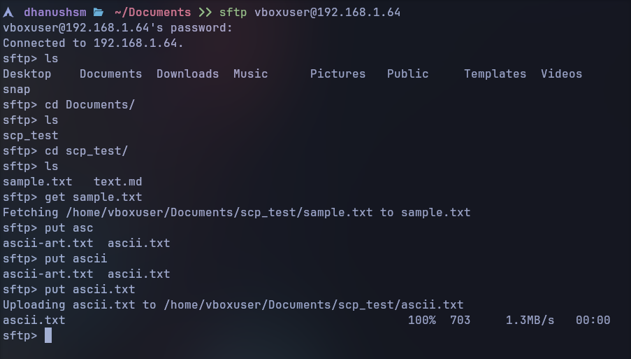
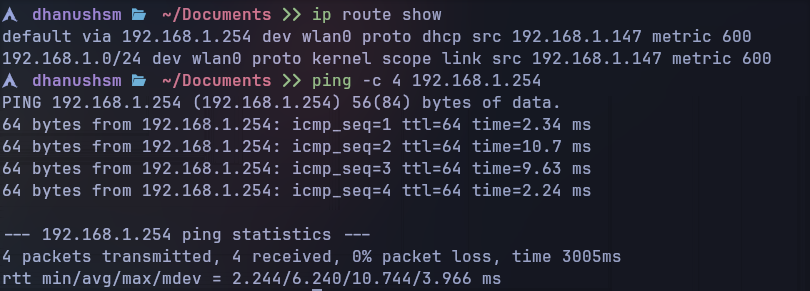
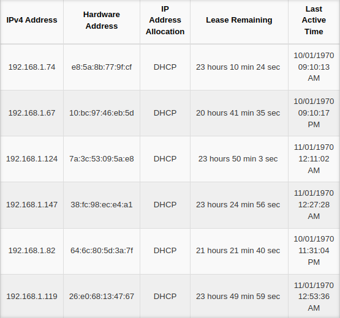

# Module 1 and 2 Assignment 

### 1. Consider a case, a folder has multiple files and how would you copy it to destination machine path (SCP, cp options in linux)

**Using `scp` (Secure Copy)**

- To copy folder from remote machine to local machine

```bash
scp -r ~/Documents/embedur dhanushsm@192.168.1.10:~/Downloads/
```

- To copy folder from local machine to remote machine

```bash
scp -r dhanushsm@192.168.1.10:~/Downloads/embedur ~/Documents/Newdir/
```


- **Using `cp` (Local copy)

```bash
cp -r ~/Documents/embedur ~/Downloads/
```

### 2. Host a FTP and SFTP server and try PUT and GET operations.

**SFTP (Secure File Transfer Protocol)**

- SFTP is enabled by default with OpenSSH. We can use it directly

```bash
sftp vboxuser@192.168.1.64
```



**FTP (File Transfer Protocol)

- Install an FTP server (vsftpd)
- Start and enable FTP service
- `ftp <ip_addr>`

### 3. Explore with Wireshark/TCP-dump/cisco packet tracer tools and learn about packet filters

**Packet filtering in Wireshark

- ip.addr == 192.168.1.10 (Capture traffic from specific IP)
- !(ip.addr == 192.168.1.100) (Exclude from this IP)
- http (filter by protocol)
- tcp.port == 443 (Filter for HTTPS)

### 4. Understand linux utility commands like ping, arp (Understand each params from ifconfig output)

`ping` - Sends ICMP echo requests to check if a host is reachable.

```bash
ping -c 4 google.com

# Output
#  dhanushsm   ~  ping -c 4 google.com
#PING google.com (2404:6800:4007:81d::200e) 56 data bytes
#64 bytes from maa05s22-in-x0e.1e100.net (2404:6800:4007:81d::200e): icmp_seq=1 ttl=60 time=167 ms
#64 bytes from maa05s22-in-x0e.1e100.net (2404:6800:4007:81d::200e): icmp_seq=2 ttl=60 time=62.9 ms
#64 bytes from maa05s22-in-x0e.1e100.net (2404:6800:4007:81d::200e): icmp_seq=3 ttl=60 time=98.8 ms
#64 bytes from maa05s22-in-x0e.1e100.net (2404:6800:4007:81d::200e): icmp_seq=4 ttl=60 time=22.9 ms

#--- google.com ping statistics ---
#4 packets transmitted, 4 received, 0% packet loss, time 3003ms
#rtt min/avg/max/mdev = 22.871/87.803/166.650/52.856 ms
```

`arp` - Shows MAC addresses of connected devices

```bash
arp -a #shows all ARP entries in the table

# Output
#  dhanushsm   ~  arp -a
#_gateway (192.168.1.254) at 24:0b:88:5c:34:80 [ether] on wlan0
```

`ifconfig` - Used to configure, display and manage network interfaces on Linux systems.

```bash
ifconfig wlan0

# Output
#  dhanushsm   ~  ifconfig wlan0
#wlan0: flags=4163<UP,BROADCAST,RUNNING,MULTICAST>  mtu 1500
#        inet 192.168.1.147  netmask 255.255.255.0  broadcast 192.168.1.255
#        inet6 2404:8ec0:4:4815:4a8e:7134:3237:6a0e  prefixlen 64  scopeid 0x0<global>
#        inet6 fe80::230e:de85:309b:d316  prefixlen 64  scopeid 0x20<link>
#        ether 38:fc:98:ec:e4:a1  txqueuelen 1000  (Ethernet)
#        RX packets 9236318  bytes 12761507735 (11.8 GiB)
#        RX errors 0  dropped 0  overruns 0  frame 0
#        TX packets 2792057  bytes 305529239 (291.3 MiB)
#        TX errors 0  dropped 0 overruns 0  carrier 0  collisions 0
```

- `<UP, BROADCAST, RUNNING, MULTICAST` - supports broadcast and multicast, interface is up and operational
- `inet` - IP address
- `netmask` - Subnet mask
- `MTU` - Maximum Transmission Unit Size

### 5. Understand what happens when duplicate IPs configured in a network

Two devices with the same IP cause network issues

- One or both devices may lose network connectivity
- ARP cache conflicts
- Log errors in system/network logs

```bash
arp -a | grep <conflicted_ip> # to detect conflicts
```

### 6. Understand how to access remote system using (VNC viewer, Anydesk, teamviewer and remote desktop connections)

**Windows Remote Desktop Protocol (RDP)**

- Linux to Windows 

```bash
rdesktop -u username remote_host_ip
```

- Windows to Linux - `Remmina`

### 7. How to check you default gateway is reachable or not and understand about default gateway

```bash
ip route show # Shows the default gateway
```



### 8. Check iwconfig/ifconfig to understand in detail about network interfaces (check about interface speed, MTU and other parameters)

**`iw` - for Wireless Networks**

```bash
iw dev wlan0 link

# Output
#Connected to 24:0b:88:5c:34:89 (on wlan0)
#        SSID: MANIKANDAN
#        freq: 2452.0
#        RX: 4606290 bytes (22493 packets)
#        TX: 4229784 bytes (27911 packets)
#        signal: -61 dBm
#        rx bitrate: 144.4 MBit/s MCS 15 short GI
#        tx bitrate: 144.4 MBit/s MCS 15 short GI
#        bss flags: short-slot-time
#        dtim period: 1
#        beacon int: 100
```
- `dev` - denotes network interface device
- `wlan0` - interface name
- `link` - current connection status


**`ifconfig` - for ethernet**

```bash
ifconfig eth0
```

### 9. Log in to you home router's web interface and check the connected devices list.



### 10. Explain how a DHCP server assigns IP addresses to devices in your network.

Dynamic Host Configuration Protocol (DHCP) assigns IPs to devices dynamically.
- Steps:
    1. Device sends a DHCP Discover request.
    2. Server responds with a DHCP Offer.
    3. Device sends a DHCP Request.
    4. Server sends a DHCP Acknowledgment.

### 11. Using a terminal, connect to a remote machine via SSH and telnet.

**SSH (Secure Shell)**

```bash
ssh user@192.168.1.100
```

**Telnet (Unsecure Remote Login)** 

```bash
telnet 192.168.1.100 
```

