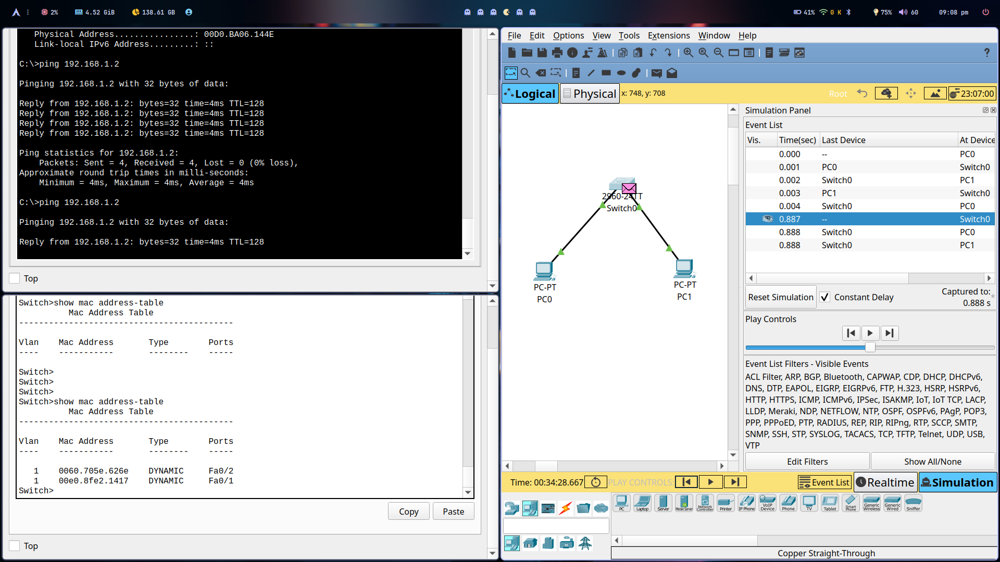
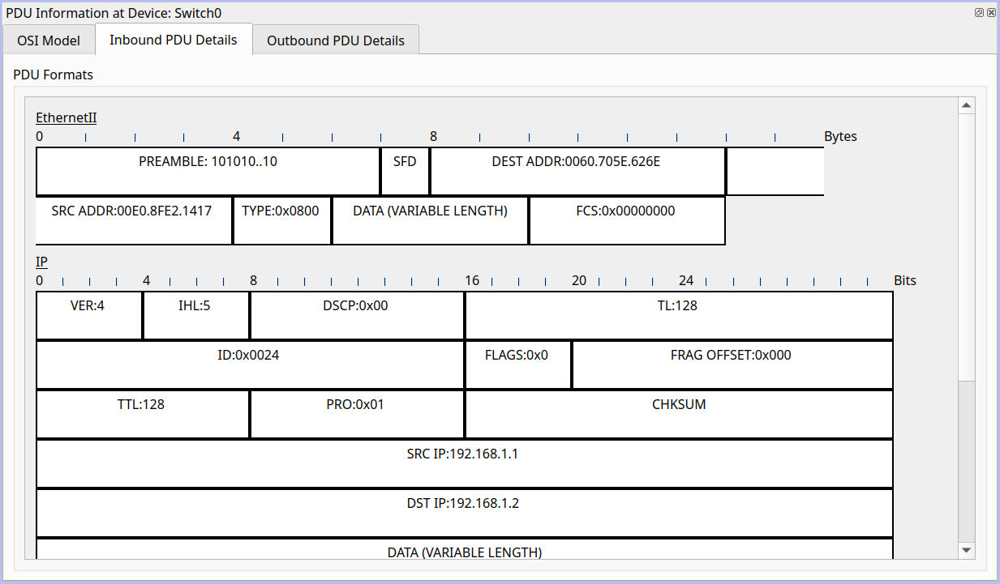
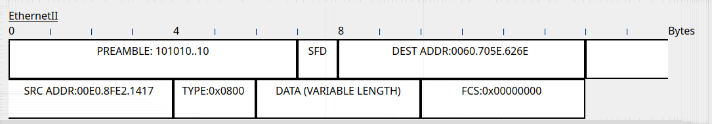
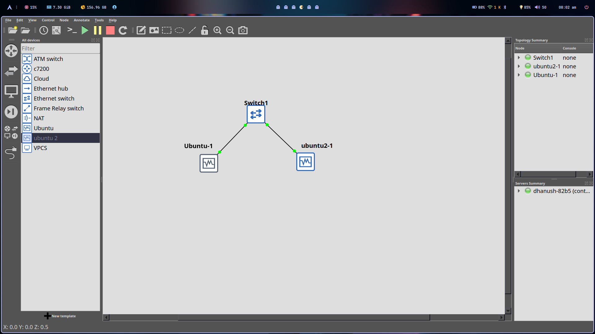
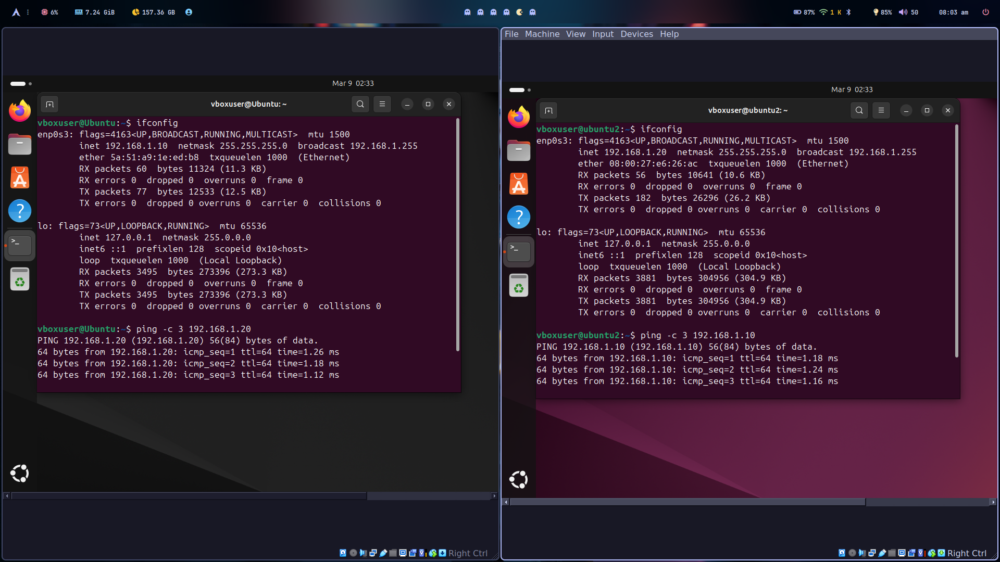
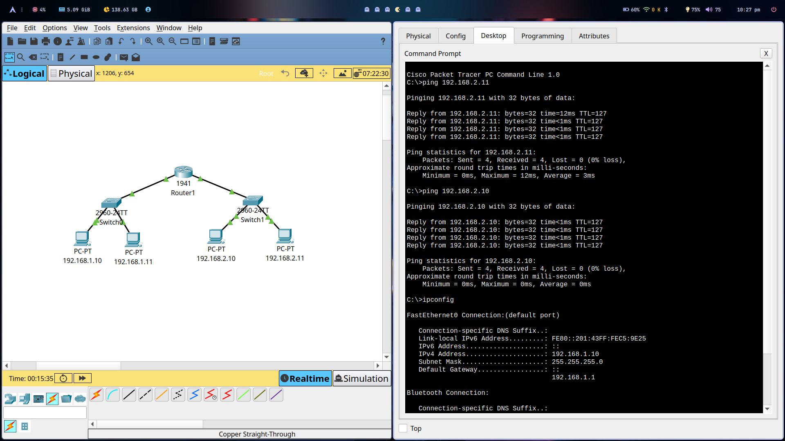
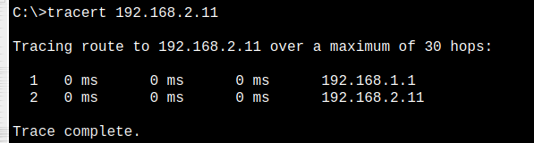

# Module 3 and 4 Assignment

### 1. Simulate a small network with switches and multiple devices. Use ping to generate traffic and observe the MAC address table of the switch. Capture packets using Wireshark to analyze Ethernet frames and MAC addressing.





### 2. Capture and analyze Ethernet frames using Wireshark. Inspect the structure of the frame, including destination and source MAC addresses. Ethertype, payload and FCS. Use GNS3 or Packet Tracer to simulate network traffic.



### 3. Configure static IP addresses, modify MAC addresses, and verify network connectivity using ping and ifconfig commands.





### 4. Troubleshoot Ethernet Communication with ping and traceroute -> Using cisco packet tracer:





### 5. Create a simple LAN setup with two Linux machines connected via a switch.


# Report and Observations

## 1. **Linux Kernel's Handling of Ethernet Communication**

- **Network Interface Drivers**: Ethernet interfaces (e.g., `eth0`, `enp0s3`) are managed by device drivers specific to network hardware.
- **Packet Processing**: Incoming and outgoing packets pass through the kernel’s networking stack, which consists of layers such as the 
**Link Layer**, **IP Layer**, and **Transport Layer**.
- **ARP (Address Resolution Protocol)**: The kernel maintains an ARP cache to resolve IP addresses to MAC addresses.
- **Netfilter and iptables**: Packet filtering, NAT, and firewalling are handled via Netfilter hooks in the kernel.
- **sysfs and procfs**: The kernel exposes network configuration and statistics via `/sys/class/net/` and `/proc/net/`.

## 2. **Configuring a Basic LAN Interface Using `ip` Command**

### **Step 1: Assign an IP Address**
```bash
sudo ip addr add 192.168.1.10/24 dev enp0s3
```

### **Step 2: Bring the Interface Up**
```bash
sudo ip link set enp0s3 up
```

### **Step 3: Set Default Gateway (if required)**
```bash
sudo ip route add default via 192.168.1.1
```

### **Step 4: Finally, verify the Configuration**
```bash
ip addr show enp0s3
ip route show
```

## 3. **Viewing MAC Address Table on a Linux-Based Switch**
If using a Linux-based switch, we can inspect the MAC table using:

### **Using `bridge` Command**
```bash
sudo bridge fdb show
```

### **Using `ip link` Command**
```bash
ip link show
```

---

## 4. **Observations and Explanation**
- The two Linux machines successfully communicated via a switch after setting IP addresses and ensuring MAC address resolution.
- `ping` worked between the machines, confirming proper ARP resolution and switch operation.
- `traceroute` showed a direct path between the machines without any drops, as expected in a LAN setup.
- The `bridge fdb show` command displays the MAC addresses learned by the switch, demonstrating its functionality in forwarding frames correctly.
- The Linux kernel efficiently manages Ethernet communication through its network stack and device drivers, ensuring seamless packet transmission and reception.


