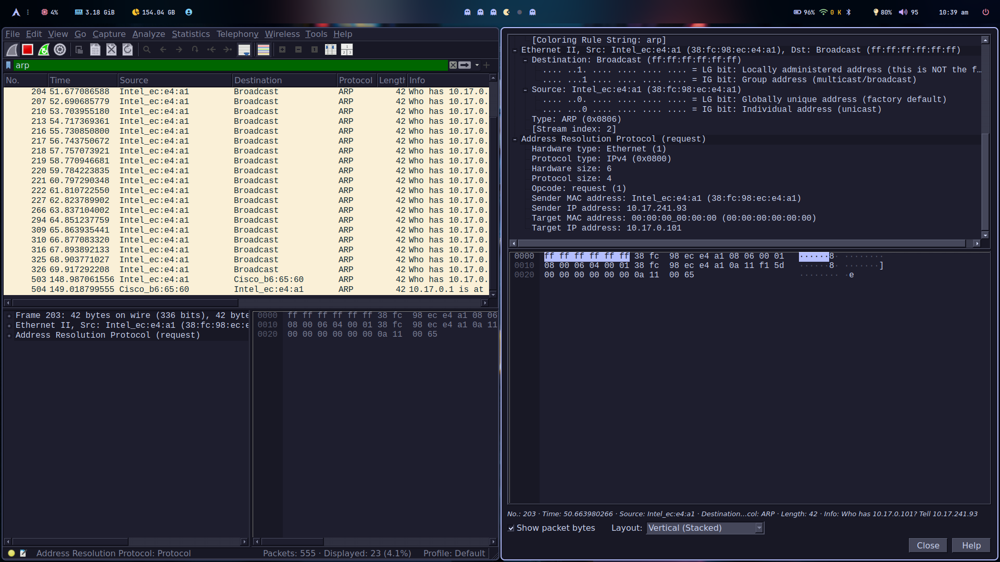
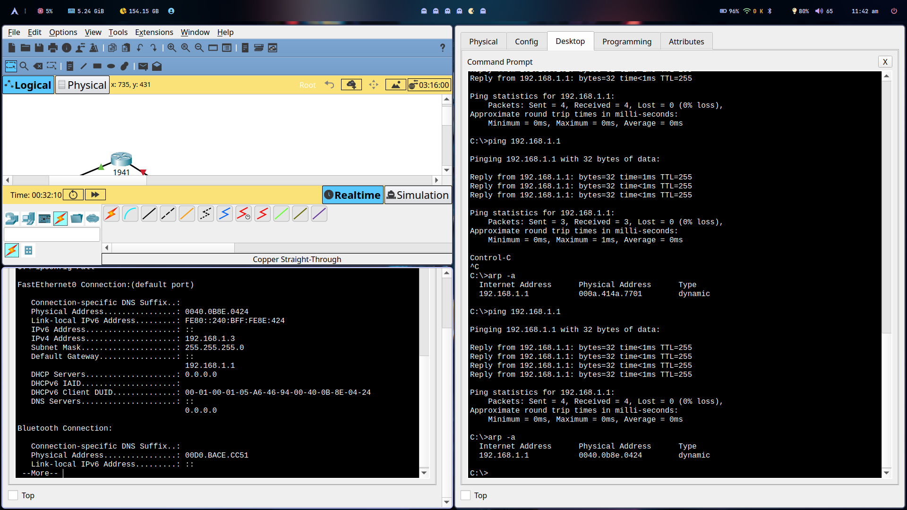
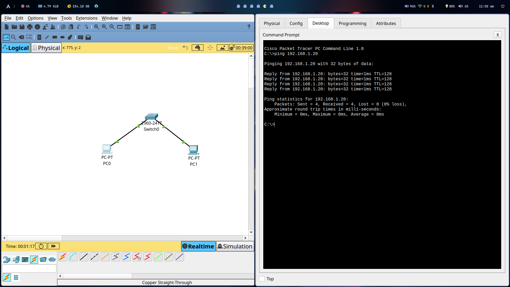
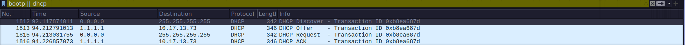
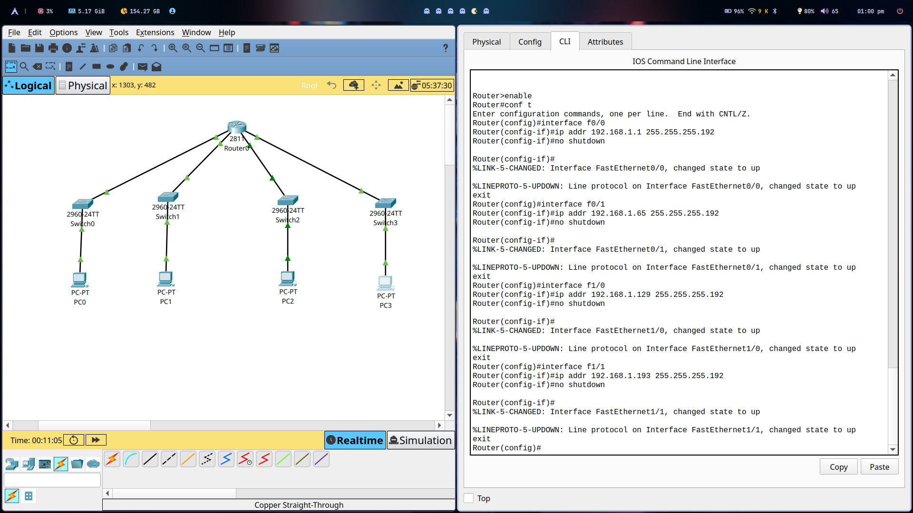
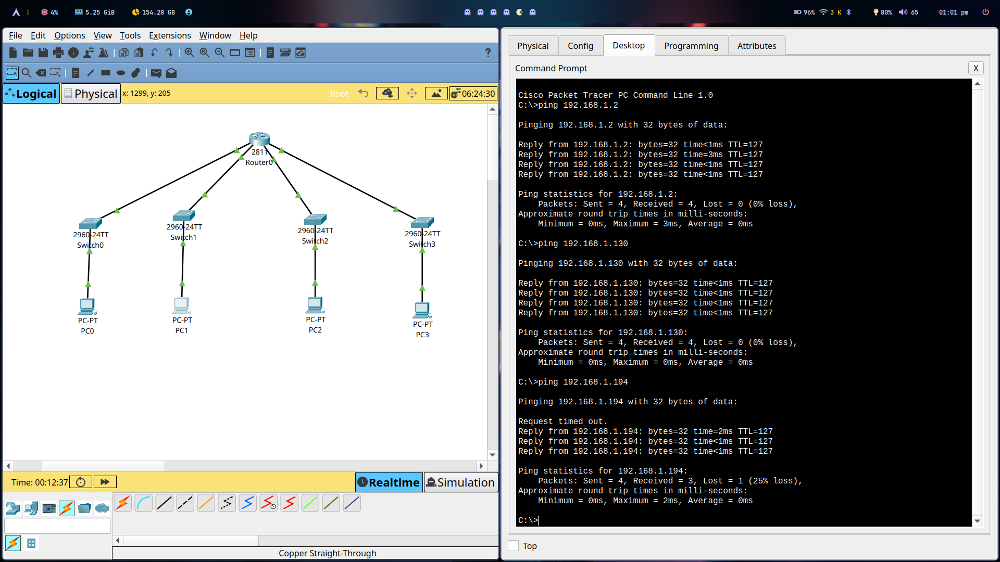
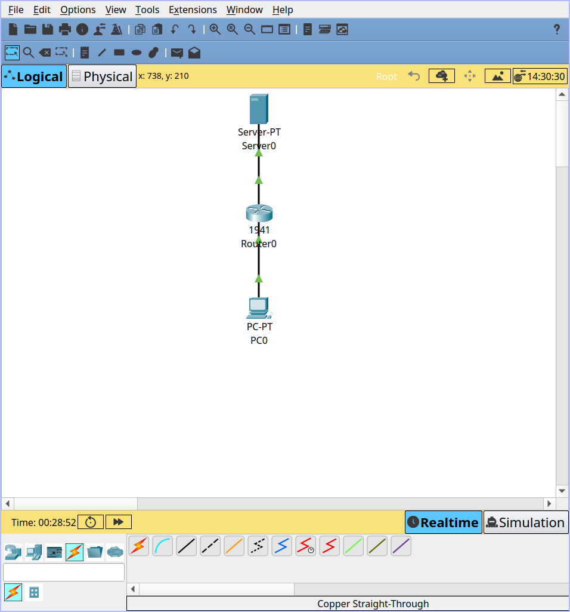
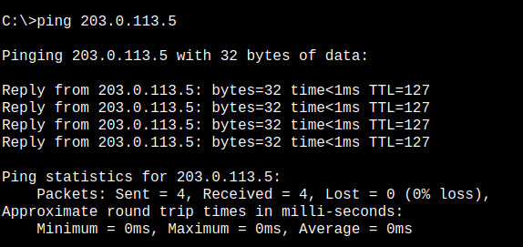
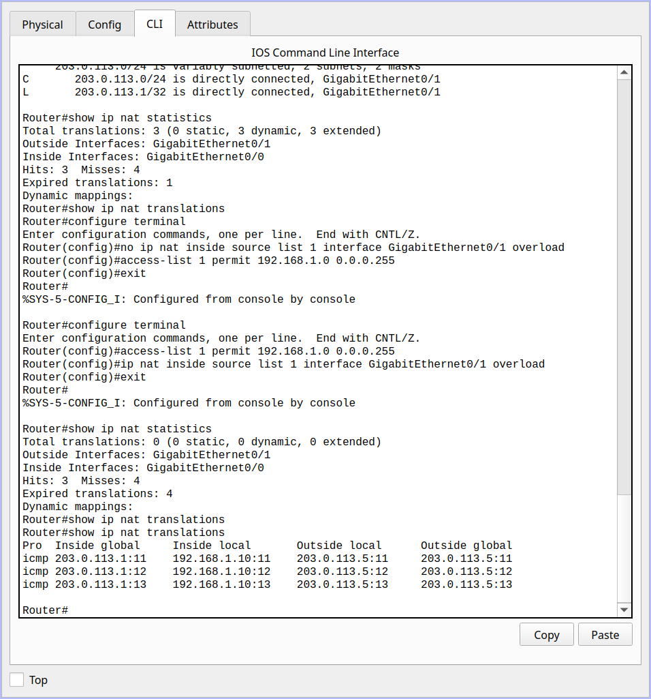

# Module 5 Assignment

## 1) Capture and analyze ARP packets using Wireshark. Inspect the ARP request and reply frames, and discuss the role of the sender's IP and MAC address in these packets. 



- ARP Request: Sent by a device asking "Who has this IP? Tell me your MAC."
- ARP Reply: The target device responds with its MAC address.
- The sender's IP and MAC address are included to ensure proper communication.

## 2) Using Packet Tracer, simulate an ARP spoofing attack. Analyze the behavior of devices on the network when they receive a malicious ARP response. 



- ARP spoofing tricks devices into sending traffic to the attacker instead of the router.

## 3) Manually configure static IPs on the client devices(like Pc or your mobile phone) and verify connectivity using ping. 



- Manually setting IP ensures devices don’t rely on DHCP and prevents conflicts.

## 4) Use Wireshark to capture DHCP Discover, Offer, Request, and Acknowledge messages and explain the process. 



- DHCP Discover: Client asks for an IP.
- DHCP Offer: Server offers an IP.
- DHCP Request: Client accepts an offer.
- DHCP Acknowledge: Server confirms assignment.

## 5) Given an IP address range of 192.168.1.0/24, divide the network into 4 subnets.
Task: Manually calculate the new subnet mask and the range of valid IP addresses for each subnet. 
Assign IP addresses from these subnets to devices in Cisco Packet Tracer and verify connectivity using ping between them. 


#### Calculate new subnet mask:

- Default mask: 255.255.255.0 (/24)
- Divide into 4 subnets → /26 (255.255.255.192)

#### Subnet Ranges:

- Subnet 1: 192.168.1.0 - 192.168.1.63
- Subnet 2: 192.168.1.64 - 192.168.1.127
- Subnet 3: 192.168.1.128 - 192.168.1.191
- Subnet 4: 192.168.1.192 - 192.168.1.255



>[!NOTE]
> - Used NM-2FE2W Module for extra FastEthernet Ports as the Router 2811 has only 2 FastEthernet Ports.



## 6) You are given three IP addresses: 10.1.1.1, 172.16.5.10, and 192.168.1.5. 
Task: Identify the class of each IP address (Class A, B, or C). What is the default subnet mask for each class? 
Provide the range of IP addresses for each class. 

### Classify IP Addresses:
- 10.1.1.1 → Class A
- 172.16.5.10 → Class B
- 192.168.1.5 → Class C

### Default Subnet Masks:
- Class A: 255.0.0.0
- Class B: 255.255.0.0
- Class C: 255.255.255.0

### IP Ranges for Each Class:
- Class A: 10.0.0.0 - 10.255.255.255
- Class B: 172.16.0.0 - 172.31.255.255
- Class C: 192.168.0.0 - 192.168.255.255

IP classes determine how large a network can be.

## 7) In Cisco Packet Tracer, create a small network with multiple devices (e.g., 2 PCs and a router). Use private IP addresses (e.g., 192.168.1.x) on the PCs and configure the router to perform NAT to allow the PCs to access the internet. 
Task: Test the NAT configuration by pinging an external IP address from the PCs and capture the traffic using Wireshark. 
What is the source IP address before and after NAT? 


#### Network Setup



#### Configuring the NAT

```
Router(config)# access-list 1 permit 192.168.1.0 0.0.0.255
Router(config)# ip nat inside source list 1 interface g0/0 overload
Router(config)# interface g0/0
Router(config-if)# ip nat inside
Router(config-if)# exit
Router(config)# interface g0/1
Router(config-if)# ip nat outside
Router(config-if)# exit
```

#### Pinging the server



#### NAT translations




