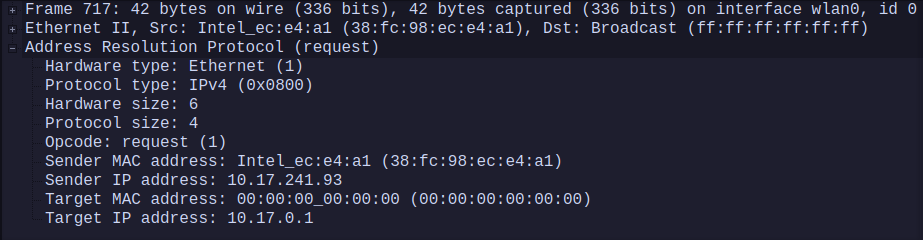
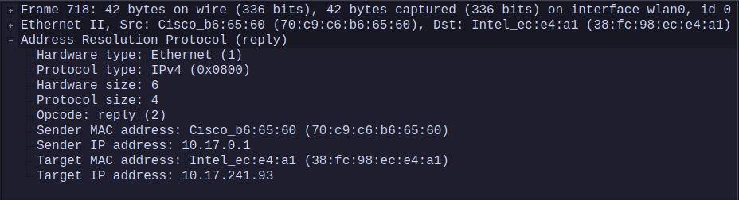
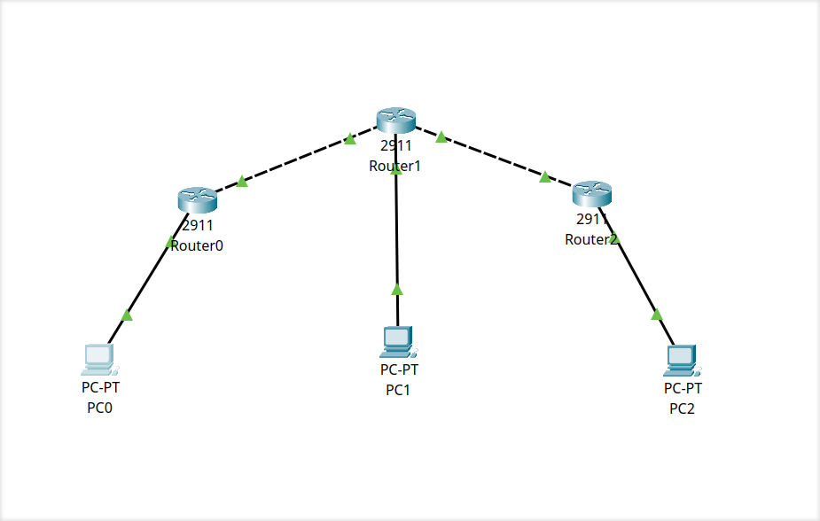
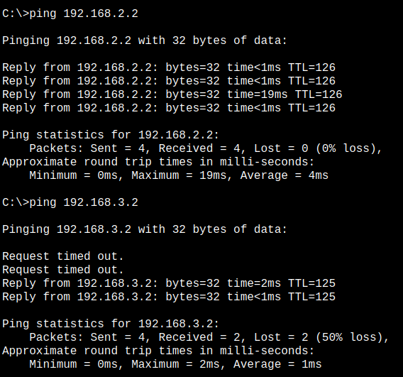
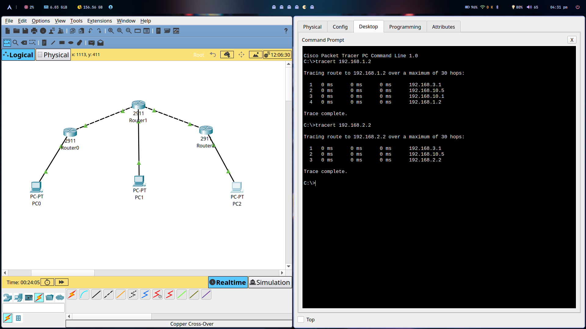
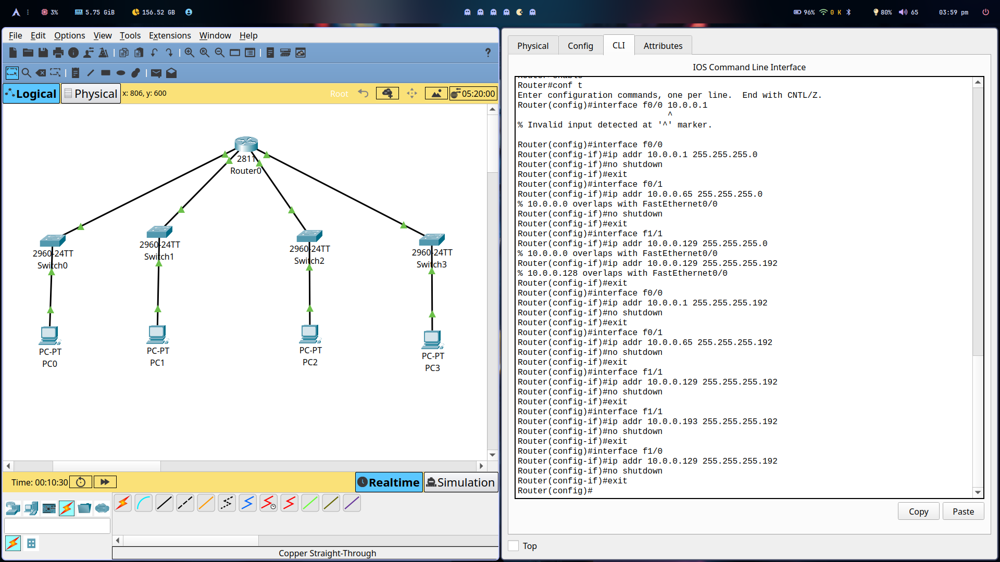
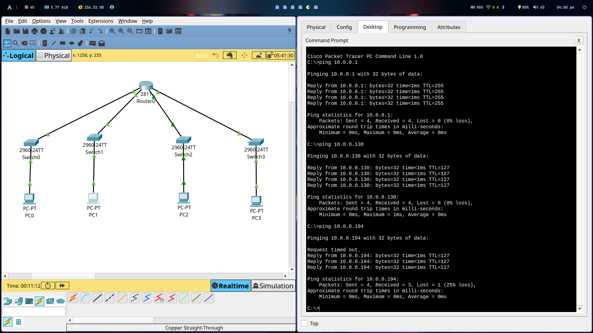
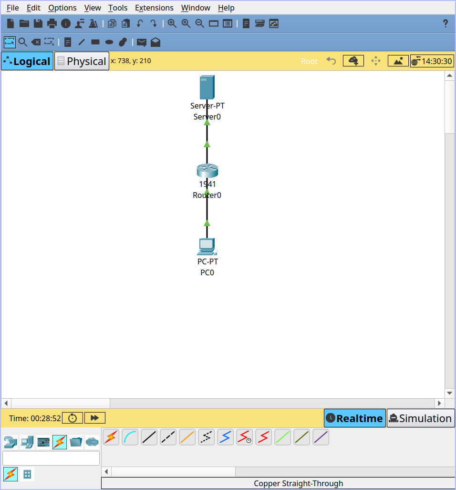
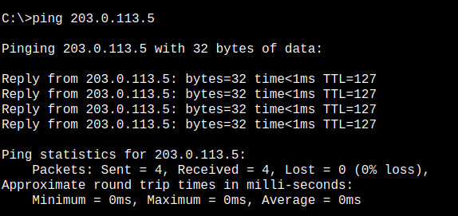
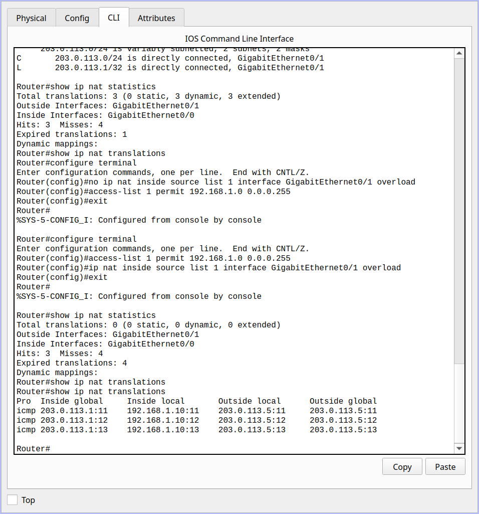

# Module 6 Assignment

## 1. Capture and analyze ARP packets using Wireshark. Inspect the ARP request and reply frames when your device attempts to find the router's MAC address. Discuss the importance of ARP in packet forwarding. 

### ARP Request



### ARP Reply



- ARP (Address Resolution Protocol) maps an IP address to a MAC address.
- When a device sends packets in a local network, it needs the MAC address of the next hop.
- Without ARP, devices wouldn't know where to send packets in a subnet.

## 2. Manually configure static routes on a router to direct packets to different subnets. Use the ip route command and verify connectivity using ping and traceroute. 

#### Configure Routers

1. Configure Router 1 (R1)

```
enable
configure terminal

interface g0/0
ip address 192.168.1.1 255.255.255.0
no shutdown
exit


```

```
interface g0/1
ip address 192.168.10.1 255.255.255.252
no shutdown
exit
```

- Exit and save configuration:

```
write memory
exit
```

2. Configure Router 2 (R2)

```
enable
configure terminal

interface g0/1
ip address 192.168.10.2 255.255.255.252
no shutdown
exit


```

```
interface g0/0
ip address 192.168.2.1 255.255.255.0
no shutdown
exit
```

```
interface g0/2
ip address 192.168.10.5 255.255.255.252
no shutdown
exit
```

- Exit and save configuration:

```
write memory
exit
```

3. Configure Router 3 (R3)

```
enable
configure terminal
```

```
interface g0/1
ip address 192.168.10.6 255.255.255.252
no shutdown
exit
```

```
interface g0/0
ip address 192.168.3.1 255.255.255.0
no shutdown
exit
```
- Exit and save configuration:

```
write memory
exit
```

#### Step 3: Configure Static Routes

1. Configure R1 to Reach Subnet B (192.168.2.0/24) and Subnet C (192.168.3.0/24)

```
enable
configure terminal
ip route 192.168.2.0 255.255.255.0 192.168.10.2  # Route to Subnet B via R2
ip route 192.168.3.0 255.255.255.0 192.168.10.2  # Route to Subnet C via R2
exit
write memory
```

2. Configure R2 to Reach Subnet A (192.168.1.0/24) and Subnet C (192.168.3.0/24)

```
enable
configure terminal
ip route 192.168.1.0 255.255.255.0 192.168.10.1  # Route to Subnet A via R1
ip route 192.168.3.0 255.255.255.0 192.168.10.6  # Route to Subnet C via R3
exit
write memory
```

3. Configure R3 to Reach Subnet A (192.168.1.0/24) and Subnet B (192.168.2.0/24)

```
enable
configure terminal
ip route 192.168.1.0 255.255.255.0 192.168.10.5  # Route to Subnet A via R2
ip route 192.168.2.0 255.255.255.0 192.168.10.5  # Route to Subnet B via R2
exit
write memory
```

#### Network Topology




#### Ping Test




#### Traceroute



## 3. Given a network address of 10.0.0.0/24, divide it into 4 equal subnets. 

#### Calculate the new subnet mask.

Original Network: 10.0.0.0/24
4 equal subnets → Increase subnet bits by 2 (/26).
New subnet mask: 255.255.255.192

#### Determine the valid host range for each subnet. 

```
Subnet 1: 10.0.0.0/26   (Hosts: 10.0.0.1 - 10.0.0.62, Broadcast: 10.0.0.63)
Subnet 2: 10.0.0.64/26  (Hosts: 10.0.0.65 - 10.0.0.126, Broadcast: 10.0.0.127)
Subnet 3: 10.0.0.128/26 (Hosts: 10.0.0.129 - 10.0.0.190, Broadcast: 10.0.0.191)
Subnet 4: 10.0.0.192/26 (Hosts: 10.0.0.193 - 10.0.0.254, Broadcast: 10.0.0.255)
```

#### Assign IP addresses to devices in Packet Tracer and verify connectivity. 

- Configuration:



- Ping Test



## 4. You are given three IP addresses: 192.168.10.5, 172.20.15.1, and 8.8.8.8. 

#### Identify the class of each IP address and Determine if it is private or public. 

- 192.168.10.5 → Class C, Private
- 172.20.15.1 → Class B, Private
- 8.8.8.8 → Class A, Public

#### Explain how NAT would handle a private IP when accessing the internet. 

- NAT translates private IPs (192.168.x.x, 172.16-31.x.x, 10.x.x.x) to a public IP before accessing the internet.

```

Example:
Internal IP: 192.168.1.100 → Router NAT → Public IP: 203.0.113.5
```

- NAT allows multiple devices to share one public IP.


## In Cisco Packet Tracer, configure NAT on a router to allow internal devices (192.168.1.x) to access the internet. 
Test connectivity by pinging an external public IP. 
Capture the traffic in Wireshark and analyze the source IP before and after NAT translation.

#### Network Setup



#### Configuring the NAT

```
Router(config)# access-list 1 permit 192.168.1.0 0.0.0.255
Router(config)# ip nat inside source list 1 interface g0/0 overload
Router(config)# interface g0/0
Router(config-if)# ip nat inside
Router(config-if)# exit
Router(config)# interface g0/1
Router(config-if)# ip nat outside
Router(config-if)# exit
```

#### Pinging the server



#### NAT translations




