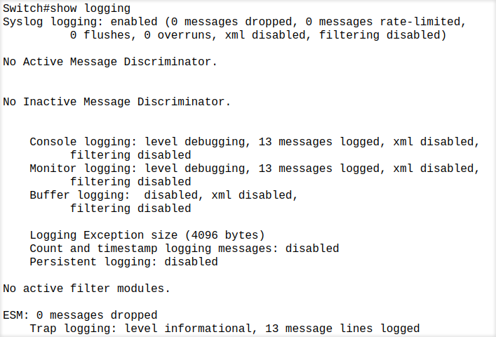
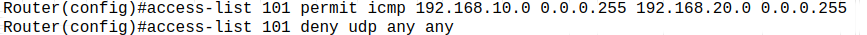

# Module 7 and 8 Assignment

## 1. Try Test-Connection (Windows) / Ping (Linux) and nslookup commands for below websites 
- www.google.com 

```bash
ping -c 4 www.google.com
```

```bash
nslookup www.google.com
```

- www.facebook.com 

```bash

ping -c 4 www.facebook.com
```

```bash
nslookup www.facebook.com
```

- www.amazon.com 

```bash

ping -c 4 www.amazon.com
```

```bash
nslookup www.amazon.com
```

- www.github.com

```bash

ping -c 4 www.github.com
```

```bash
nslookup www.github.com
```

- www.cisco.com 

```bash

ping -c 4 www.cisco.com
```

```bash
nslookup www.cisco.com
```


## 2. Use Wireshark to capture and analyze DNS, TCP, UDP traffic and packet header, packet flow, options and flags 

### UDP 


### TCP 


### DNS 


# 3. Explore traceroute/tracert for different websites eg:google.com and analyse the parameters in the output and explore different options for traceroute command 

```bash
traceroute www.google.com
```


Use TCP mode:

```bash

traceroute -T www.google.com
```

Limit max hops:

```bash

traceroute -m 15 www.google.com
```

# Use Cisco packet tracer for the below 

## 5. Set up trunk ports between switches and try ping between different VLANS. 

#### Network Topology


#### Ping Test within VLANs and between different VLANs


## 6. Change the native VLAN on a trunk port. Test for VLAN mismatches and troubleshoot. 

#### Mismatched Native VLAN on a trunk port (VLAN 99 in switch 1 and VLAN 1 in switch 2)


#### Correct Native VLAN on a trunk port (VLAN 99 on both)



## 7. Configure a management VLAN and assign an IP address for remote access. Test SSH or Telnet access to the switch. 

#### Management VLAN Configured (VLAN 30)


#### Telnet Session


## 8. You have a Cisco switch and a VoIP phone that needs to be placed in a voice VLAN (VLAN 20). The data for the PC should remain in a separate VLAN (VLAN 10). Configure the switch port to support both voice and data traffic. 


A switch port to handle both data and voice traffic using: (fa0/5)

- switchport access vlan 10 (for PC traffic)
- switchport voice vlan 20 (for VoIP traffic)


## 9. You configured VLANs 10 and 20 on your switch and assigned ports to each VLAN. However, devices in VLAN 10 cannot communicate with devices in VLAN 20. Troubleshoot the issue. 

#### Network Topology and Ping Test


#### VLAN configuration in Switch 1


#### VLAN configuration in Switch 2


#### Trunk interface configuration


>[!NOTE]
> - As both are in different VLANs PC1 cannot communicate with PC3 and PC4. We need to configure a router to allow inter VLAN communication.

## 10. Try Inter VLAN routing with Router 

#### Network Topology


#### Configuring Switch

- Create VLANs on the Switch

```
Switch(config)# vlan 10
Switch(config-vlan)# name DATA_VLAN
Switch(config-vlan)# exit

Switch(config)# vlan 20
Switch(config-vlan)# name VOICE_VLAN
Switch(config-vlan)# exit
```

```
Switch# show vlan brief #To verify
```

- Assigning ports to VLANs

```
Switch(config)# interface Fa0/1
Switch(config-if)# switchport mode access
Switch(config-if)# switchport access vlan 10
Switch(config-if)# no shutdown
Switch(config-if)# exit

Switch(config)# interface Fa0/2
Switch(config-if)# switchport mode access
Switch(config-if)# switchport access vlan 20
Switch(config-if)# no shutdown
Switch(config-if)# exit
```

- Configuring trunk port to the router

```
Switch(config)# interface Fa0/3
Switch(config-if)# switchport mode trunk
Switch(config-if)# switchport trunk encapsulation dot1q
Switch(config-if)# switchport trunk allowed vlan 10,20
Switch(config-if)# no shutdown
Switch(config-if)# exit
```

```
Switch# show interfaces trunk # To verify trunk ports
```


#### Configuring Router

- To configure router sub interfaces

```
Router(config)# interface GigabitEthernet0/0
Router(config-if)# no shutdown
Router(config-if)# exit

Router(config)# interface GigabitEthernet0/0.10
Router(config-subif)# encapsulation dot1Q 10
Router(config-subif)# ip address 192.168.10.1 255.255.255.0
Router(config-subif)# exit

Router(config)# interface GigabitEthernet0/0.20
Router(config-subif)# encapsulation dot1Q 20
Router(config-subif)# ip address 192.168.20.1 255.255.255.0
Router(config-subif)# exit
```

```
Router# show ip interface brief # To verify the interfaces
```


#### Ping Test between 2 different VLANs


## 11. Implement ACLs to restrict traffic based on source and destination ports. Test rules by simulating legitimate and unauthorized traffic. 

- ACL Rules



- Blocked ICMP Packets


- Allowed ICMP Packets


## 12. Configure a standard Access Control List (ACL) on a router to permit traffic from a specific IP range. Test connectivity to verify the ACL is working as intended. 

#### Configuring Standard Access Control List


#### Ping Test from 1.0 Subnet


#### Ping Test from 2.0 Subnet (fails)


## 13. Create an extended ACL to block specific applications, such as HTTP or FTP traffic. Test the ACL rules by attempting to access blocked services. 

1. Define the Extended ACL:

    - You need to create an extended ACL that will block traffic based on application ports (HTTP and FTP). Here’s how to block these protocols:

To block HTTP (port 80) and FTP (port 21):

```
Router(config)# access-list 101 deny tcp any any eq 80
Router(config)# access-list 101 deny tcp any any eq 21
Router(config)# access-list 101 permit ip any any
```

- access-list 101 deny tcp any any eq 80: This denies TCP traffic (HTTP) to port 80.
- access-list 101 deny tcp any any eq 21: This denies TCP traffic (FTP) to port 21.
- access-list 101 permit ip any any: This allows all other traffic (to avoid a total block).

2. Apply the ACL on the Router Interface:

    - Apply the extended ACL to the interface that is responsible for routing traffic between the PCs.
    - Apply it to the incoming traffic on the relevant interface (for example, g0/0 for the interface facing PC1 and g0/1 for the interface facing PC2):

- For G0/0:

```
Router(config)# interface g0/0
Router(config-if)# ip access-group 101 in
Router(config-if)# exit
```

- For G0/1:

```
Router(config)# interface g0/1
Router(config-if)# ip access-group 101 in
Router(config-if)# exit
```

This applies the ACL to control incoming traffic on both interfaces.


