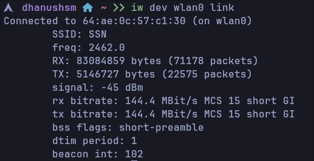
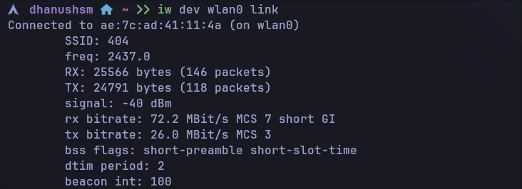
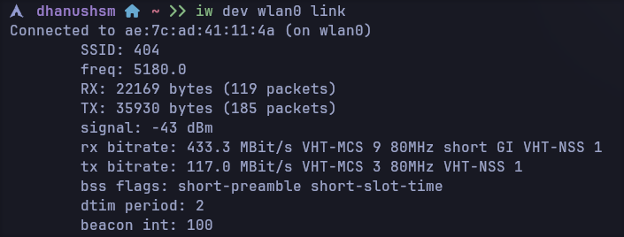

# Wi-Fi Module 1 Assignment

## 1. In which OSI layer does the Wi-Fi standard/protocol fit?

Wi-Fi operates primarily in the **Data Link Layer (Layer 2)** and **Physical Layer (Layer 1)** of the **OSI Model**.

- **Physical Layer (Layer 1):** Deals with radio frequency (RF) signals, transmission power, frequency bands (2.4GHz, 5GHz, 6GHz), modulation techniques (OFDM, DSSS), and antenna characteristics.
- **Data Link Layer (Layer 2):** Manages MAC (Media Access Control) addresses, framing, authentication, encryption (WPA/WPA2/WPA3), and collision handling in wireless networks.

## 2. Can you share the Wi-Fi devices that you are using day to day life, share that device's wireless capability/properties after connecting to network. Match your device to corresponding Wi-Fi Generations based on properties 

Common Wi-Fi devices include **smartphones, laptops, tablets, smart TVs, gaming consoles, and IoT devices**.

- **Example: My Laptop's Wi-Fi Properties (Connected to Network)**
After connecting to a Wi-Fi network, you can check wireless properties using:
    - **Linux:** Run `iwconfig` or `iw dev wlan0 link`
    - **Windows:** Run `netsh wlan show interfaces` in CMD

### **Mapping to Wi-Fi Generations**

| Wi-Fi Generation | IEEE Standard | Frequency |
|-----------------|--------------|------------|
| Wi-Fi 4 | 802.11n | 2.4GHz & 5GHz |
| Wi-Fi 5 | 802.11ac | 5GHz |
| Wi-Fi 6 | 802.11ax | 2.4GHz & 5GHz |
| Wi-Fi 6E | 802.11ax | 6GHz |
| Wi-Fi 7 | 802.11be | 2.4GHz, 5GHz & 6GHz |

- Since the frequency is 2.4 GHz and the bitrate is 130 Mbps, It suggests I'm using 802.11n (Wi-Fi 4).
- 802.11n operates on both 2.4 GHz and 5 GHz, and your router is using the 2.4 GHz band.

## 3. What is BSS and ESS?

- **BSS (Basic Service Set):** A Wi-Fi network with a single Access Point (AP) serving connected devices (stations). Identified by **BSSID (MAC address of the AP)**.
- **ESS (Extended Service Set):** Multiple APs connected together to provide seamless connectivity across a larger area (like university campuses or corporate networks). Identified by a **common SSID** but different BSSIDs.

## 4. Basic functionalities of a Wi-Fi Access Point (AP)

A **Wi-Fi Access Point (AP)** allows wireless devices to connect to a wired network. Its basic functions include:
- **SSID Broadcasting** – Advertises the Wi-Fi network name.
- **Authentication & Security** – Uses WPA2/WPA3 for encryption.
- **Traffic Management** – Handles multiple connected devices.
- **Channel Selection** – Avoids interference by choosing the best channel.
- **Signal Amplification** – Extends the range of Wi-Fi coverage.

## 5. Bridge Mode vs. Repeater Mode

| Feature | Bridge Mode | Repeater Mode |
|---------|------------|--------------|
| **Purpose** | Connects two networks (wired to wireless) | Extends the range of an existing Wi-Fi network |
| **IP Assignment** | Different subnets | Same subnet as main network |
| **Use Case** | Connecting wired networks to wireless networks | Boosting Wi-Fi signal in dead zones |
| **Example** | Office buildings linking LAN to Wi-Fi | Home Wi-Fi extenders |

## 6. Differences between 802.11a and 802.11b

| Feature | 802.11a | 802.11b |
|---------|--------|--------|
| **Frequency** | 5GHz | 2.4GHz |
| **Speed** | 54 Mbps | 11 Mbps |
| **Range** | Shorter due to higher frequency | Longer range but more interference |
| **Interference** | Less interference (fewer devices on 5GHz) | More interference (microwaves, Bluetooth) |

## 7. Configuring Hotspot to Operate in 2.4GHz and 5GHz & Observing Differences

### **Steps to Change Wi-Fi Frequency:**
1. **Access Router Settings:**
   - As I can't access the college Wifi Router login, I tried it using my mobile hotspot.
   - Go to **Wireless Settings** and set frequency to **2.4GHz only** and change it to **5GHz only** and note the differences.
2. **Connect the Laptop** and check properties using `iw`.

### **Observed Differences Between 2.4GHz and 5GHz**
#### 2.4 GHz Bandwidth

#### 5 GHz Bandwidth

- We can clearly observe that 5 GHz provides better speed when compared to 2.4 GHz.

## 8. Difference between IEEE and WFA

- **IEEE (Institute of Electrical and Electronics Engineers)** – Develops Wi-Fi standards like **802.11a/b/g/n/ac/ax**.
- **WFA (Wi-Fi Alliance)** – Certifies devices to ensure compliance with IEEE standards and interoperability.

## 9. Types of Wi-Fi Internet Connectivity Backhaul & My College Network

**Backhaul** refers to the connection between the main internet provider and the Wi-Fi router. Types:
1. **Fiber-optic (FTTH - Fiber to the Home)** – High-speed, low-latency (e.g., JioFiber, Airtel Xstream).
2. **DSL (Digital Subscriber Line)** – Uses telephone lines, slower than fiber.
3. **Cellular (4G/5G Broadband)** – Wireless connection via mobile network towers.
4. **Satellite Internet** – Used in remote areas (e.g., Starlink).

### **College Network:**

- Backhaul Type: Fiber-optic (FTTH)
- Speed: 144.4 Mbps (RX), 52.0 Mbps (TX)
- Latency: ~5ms
- Frequency: 2.4GHz (Channel 11, 2462 MHz)
- Signal Strength: -45 dBm

## 10. Wi-Fi Topologies & Use Cases

| Topology | Description | Use Cases |
|----------|------------|-----------|
| **Infrastructure Mode** | AP connects all devices to a wired network | Home/Office Wi-Fi |
| **Ad-hoc Mode** | Devices connect directly without an AP | P2P file sharing, emergency networks |
| **Mesh Network** | Multiple APs form a single large Wi-Fi network | Smart homes, large buildings |
| **Wi-Fi Direct** | Devices communicate without an AP | Wireless printing, file transfer |
| **Hotspot Mode** | One device shares its internet with others | Mobile tethering |

