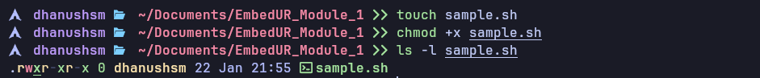
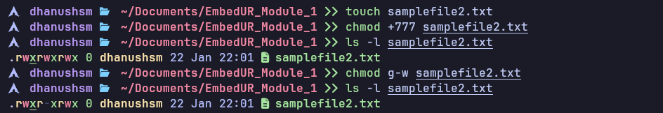
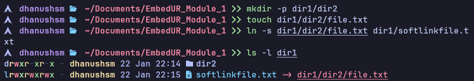
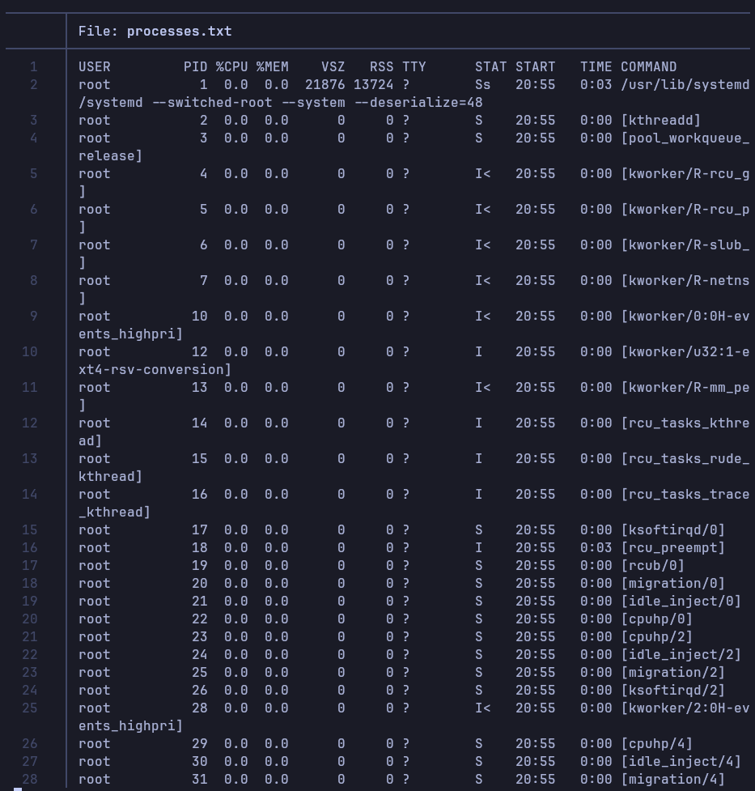
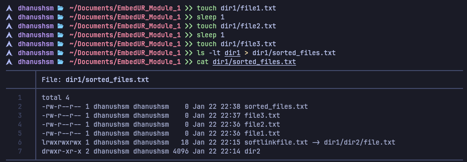

### Dhanush S M Linux Training Module 1

**1) Create a file and add executable permission to all users (user, group and others)**

```bash
touch sample.sh

chmod +x sample.sh

ls -l sample.sh
```



**2) create a file and remove write permission for group user alone.**

```bash
touch samplefile2.txt

chmod g-w samplefile2.txt

ls -l samplefile2.txt
```



**3) Create a file and add a softlink to the file in a different directory**

```bash
mkdir -p dir1/dir2

touch dir1/dir2/file

ln -s dir1/dir2/file dir1/softlink_to_file

ls -l dir1
```



**4) Use `ps` command with options to display all active processes running on the system**

```bash
ps -aux > processes.txt
```




**5) Create 3 files in `dir1` and redirect the output of the `ls` command sorted by timestamp to a file**

```bash
touch dir1/file1 dir1/file2 dir1/file3

ls -lt dir1 > dir1/sorted_files.txt

cat dir1/sorted_files.txt
```


